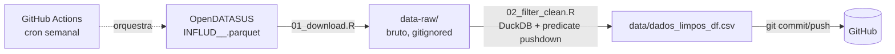

# SRAG RIDE-DF

Recorte da base de **SRAG (OpenDATASUS)** contendo apenas os municípios da
**RIDE-DF**. O bruto (parquet, centenas de MB) é baixado, filtrado e só o
CSV enxuto (`data/dados_limpos_df.csv`) é versionado no GitHub.

## Arquitetura



Princípios:
- **Bruto nunca vai pro Git.** Fica em `data-raw/` (no `.gitignore`).
- **Parquet + DuckDB**: o filtro lê só as linhas que casam a RIDE-DF, sem
  carregar tudo na RAM. Aceita vários anos de uma vez para série histórica.
- **Só o recorte é publicado**, mantendo o repositório abaixo do limite do
  GitHub (100 MB/arquivo). Acima de ~90 MB o pipeline avisa para usar Git LFS.
- **Automação semanal** via GitHub Actions; commita só se o CSV mudou.

## Estrutura

```
srag-ride-df/
├── R/
│   ├── config.R            # códigos RIDE-DF, URLs, caminhos
│   ├── 01_download.R       # baixa parquet -> data-raw/
│   └── 02_filter_clean.R   # filtra com DuckDB -> data/*.csv
├── run_pipeline.R          # orquestra tudo
├── data/dados_limpos_df.csv
├── .github/workflows/atualizar-dados.yml
└── .gitignore
```

## Como rodar localmente

```bash
Rscript -e 'install.packages(c("duckdb","DBI"))'
Rscript run_pipeline.R
```

## Atualização da fonte

O nome do arquivo do OpenDATASUS carrega a **data da revisão**
(`INFLUD26-DD-MM-AAAA.parquet`), então muda a cada atualização. Ajuste a
`SRAG_URLS` no workflow (ou em `R/config.R`). Para automatizar, dá para
consultar a API do CKAN em `dadosabertos.saude.gov.br` e pegar a URL do
recurso mais recente.
